<p align="center">
  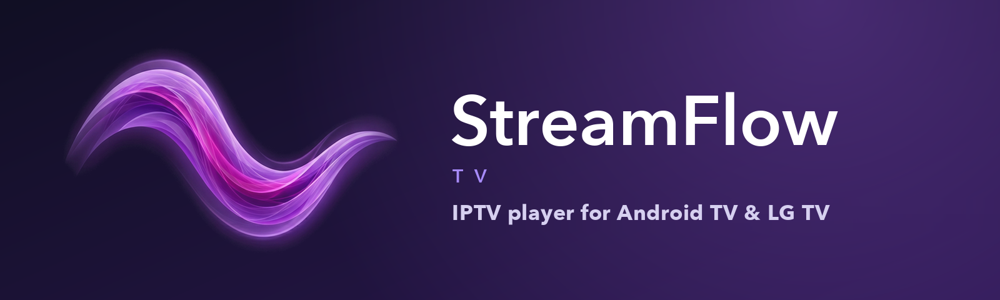
</p>

<p align="center">
  <b>An IPTV player for Android TV and LG TV, made for the remote.</b><br>
  Bring your own M3U playlist and XMLTV guide; StreamFlow does the rest.
</p>

<p align="center">
  <a href="https://github.com/Getmygity/StreamFlow-TV/releases/latest/download/StreamFlow-TV.apk"></a>
  <a href="https://github.com/Getmygity/StreamFlow-TV/releases/latest/download/StreamFlow-LG.ipk"></a>
</p>

<p align="center">
  
  
</p>

<p align="center">
  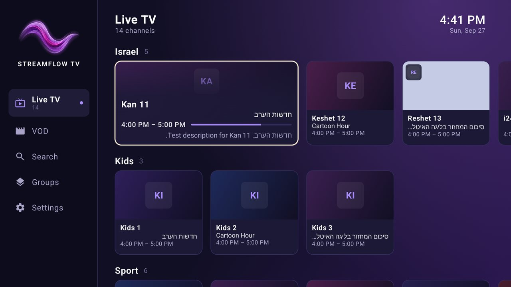
</p>

**Which one do I need?** An Android TV, Google TV or Android box takes **`StreamFlow-TV.apk`** ([install steps](#%EF%B8%8F-install-on-your-android-tv)). An LG smart TV from 2022 or later takes **`StreamFlow-LG.ipk`** ([install steps](#%EF%B8%8F-install-on-your-lg-tv)).

---

## ⬇️ Install on your Android TV

StreamFlow isn't in the Play Store, so it's installed by hand ("sideloaded"). It takes about five minutes the first time.

**1. Get the Downloader app.** On the TV, open the Play Store, search for **Downloader** (by AFTVnews), and install it.

**2. Let Downloader install apps.**
- On **Google TV**, turn on developer mode first: *Settings → System → About*, then click *Android TV OS build* 7 times.
- Then go to *Settings → Apps → Security & restrictions → Unknown sources* and switch **Downloader** on.

The menu names vary a little between TV brands.

**3. Download StreamFlow.** Open Downloader and type this address:

```
github.com/Getmygity/StreamFlow-TV/releases/latest/download/StreamFlow-TV.apk
```

Choose **Install** when it finishes. If Play Protect warns about an unknown app, choose to install anyway. You can delete the APK file afterwards to save space.

**4. Set it up from your phone.** Open **StreamFlow**, then scan the QR code on the TV with your phone. Your phone must be on the **same Wi-Fi** as the TV. Enter your **playlist (M3U) URL** and, optionally, your **guide (XMLTV) URL**. The TV loads your channels and you're in.

> **You need your own IPTV subscription.** StreamFlow is a player only; it comes with no channels.
>
> **Prefer a computer?** Download [`StreamFlow-TV.apk`](https://github.com/Getmygity/StreamFlow-TV/releases/latest/download/StreamFlow-TV.apk), then run `adb connect <tv-ip>:5555` and `adb install StreamFlow-TV.apk`.

---

## ⬇️ Install on your LG TV

For LG smart TVs with **webOS 22 or newer** (2022 models and later). StreamFlow isn't in the LG Content Store, so it goes on through LG's free **Developer Mode**, from a computer on the same network. It takes about fifteen minutes the first time.

**1. Make an LG developer account** at [webostv.developer.lge.com](https://webostv.developer.lge.com). It's free.

**2. Turn on Developer Mode on the TV.** Install the **Developer Mode** app from the LG Content Store and sign in with that account. Turn on **Dev Mode Status**; the TV restarts. Open the app again and turn on **Key Server**. Keep it open: it shows the TV's **IP address** and a **passphrase**.

**3. Connect your computer to the TV.** Install [Node.js](https://nodejs.org), then LG's tools, and pair with the TV:

```bash
npm install -g @webos-tools/cli
ares-setup-device -a mytv -i "host=<tv-ip>" -i "port=9922" -i "username=prisoner"
ares-novacom -d mytv --getkey
ares-setup-device -m mytv -i "privatekey=mytv_webos" -i "passphrase=<passphrase>"
```

`--getkey` asks for the passphrase shown on the TV.

**4. Install StreamFlow.** Download [`StreamFlow-LG.ipk`](https://github.com/Getmygity/StreamFlow-TV/releases/latest/download/StreamFlow-LG.ipk), then:

```bash
ares-install -d mytv StreamFlow-LG.ipk
ares-launch -d mytv com.youngertv.streamflow.lgtv
```

**5. Type your links.** Enter your **playlist (M3U) link** and, optionally, your **guide (XMLTV) link**, with the remote or with the **LG ThinQ** app's keyboard on your phone. The TV loads your channels and you're in. From then on StreamFlow is in the TV's app list.

> **Extend Developer Mode every few weeks.** A session lasts 1000 hours (about six weeks). Open the Developer Mode app and extend it before it runs out, or the TV removes StreamFlow along with your saved links.

<p align="center">
  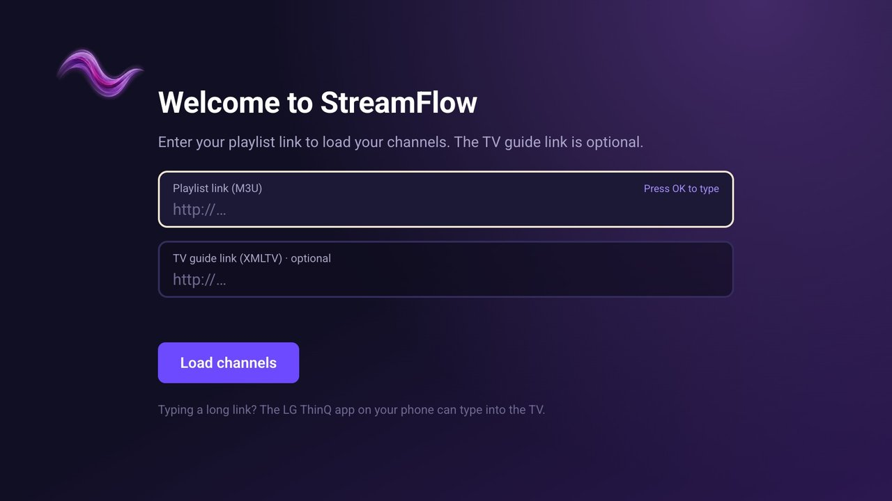<br>
  <sub>Setup on the LG TV: type your links with the remote or your phone.</sub>
</p>

---

## ✨ What it does

- **Live TV in rows by group.** The focused channel expands to show what's on, its time slot and the description, then **starts a muted live preview** in the tile.
- **Tile or list view.** On Android TV, channel cards remember the last picture each channel showed.
- **Movies & series:** series fold into seasons and episodes. **Seek** with LEFT/RIGHT (10 s → 30 s → 1 min → 5 min with quick presses) and **pause** with OK.
- **Player overlay:** a channel browser, a forward schedule, a group picker, and CH+/CH− zapping.
- **Hold OK** on a channel for Play, Information or Cancel.
- **A guide that keeps itself fresh,** search across everything, and groups you can hide and reorder.
- **Hebrew-friendly:** programme text reads right to left.

| | |
|:---:|:---:|
| 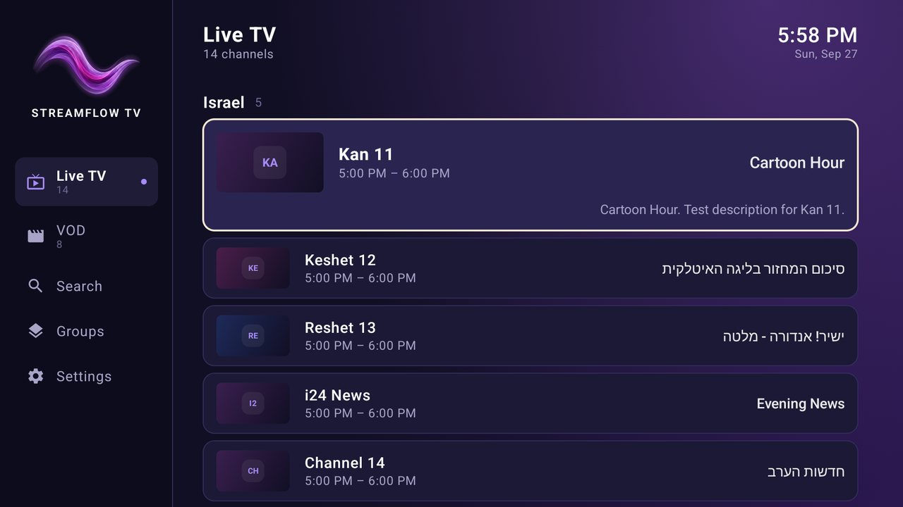<br>**List view** | 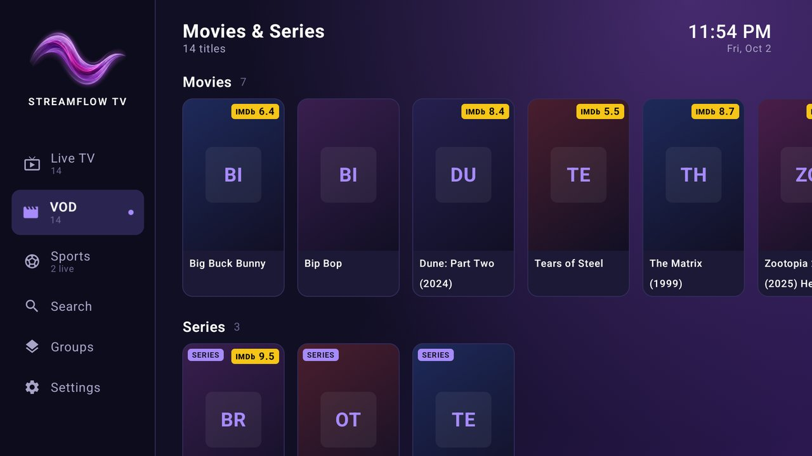<br>**Movies & series** |
| 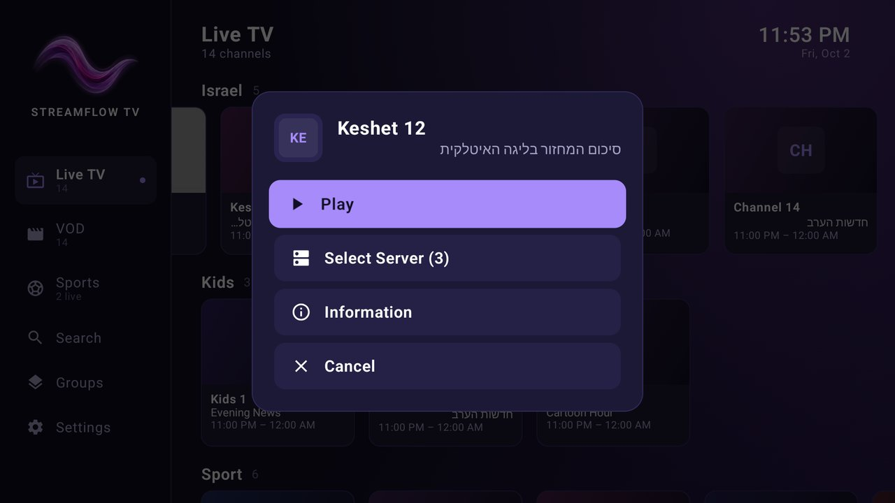<br>**Hold OK for the channel menu** | 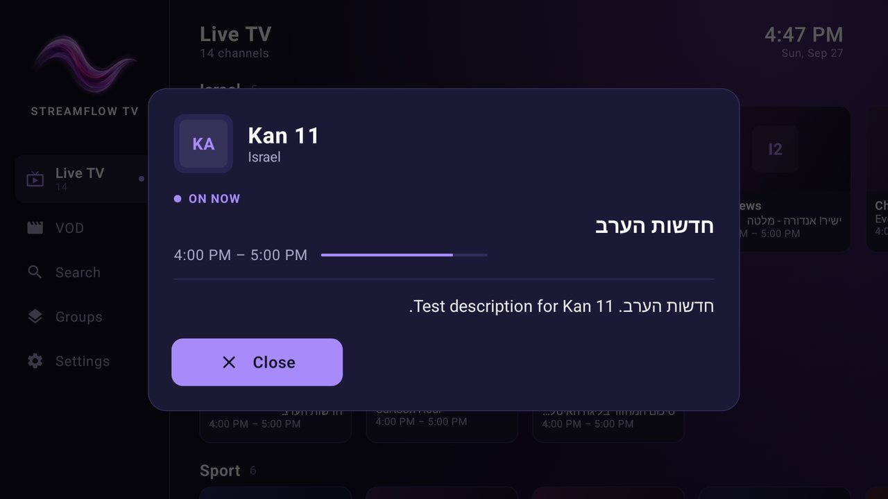<br>**Full programme information** |
| 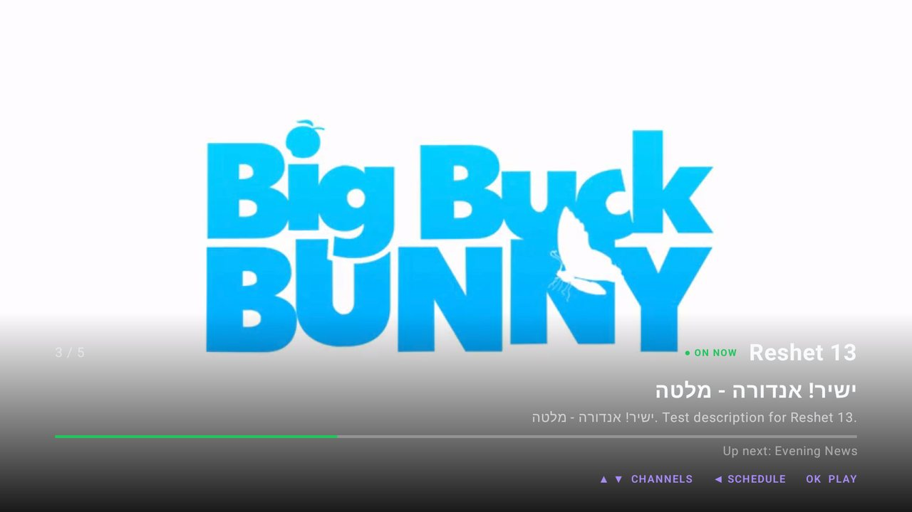<br>**Player overlay** | 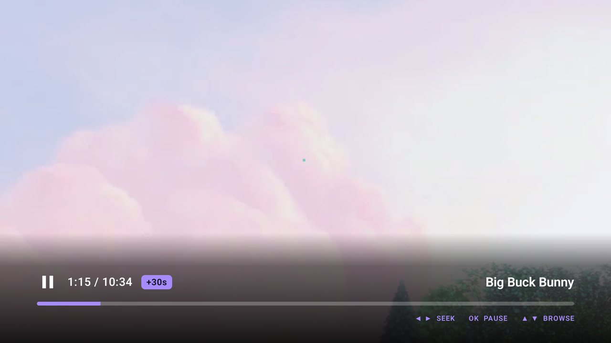<br>**Seeking a movie** |

### ⚽ New on LG TV: live sports

The LG TV version also has **Live Sports**: today's NBA and European football games, each with the channels in your guide that show it, and **goal alerts** that pop up while you watch another channel (press OK to switch). The Android TV download doesn't have it yet.

| | |
|:---:|:---:|
| 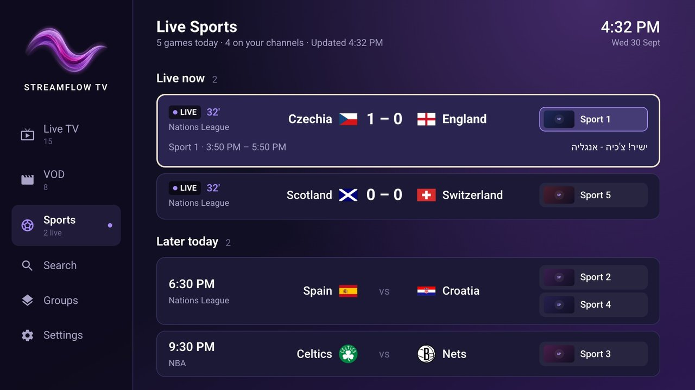<br>**Live sports** — each game with its channels | 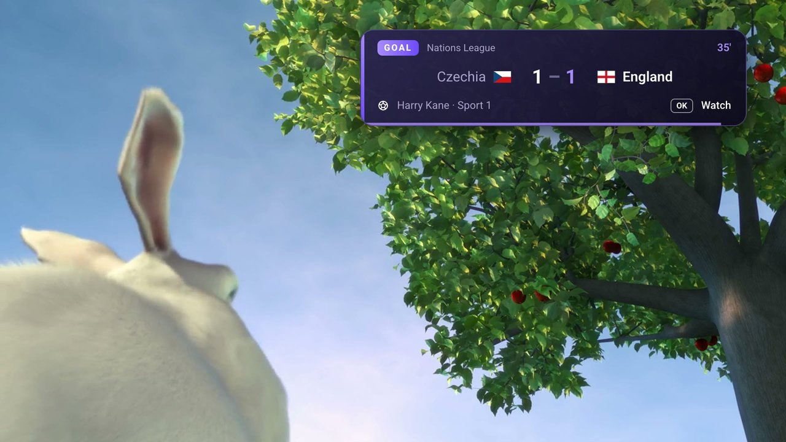<br>**Goal alert** — OK switches to the game |
| 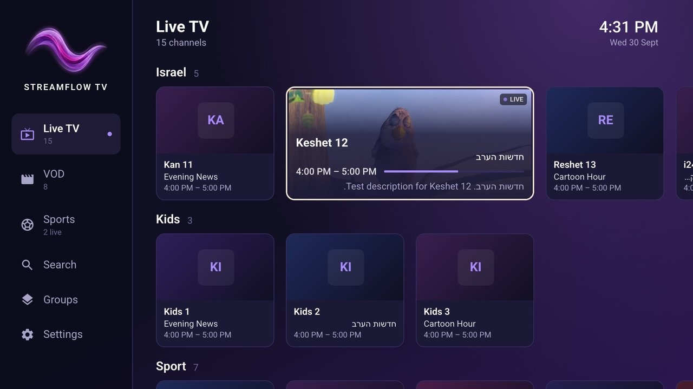<br>**LG TV home** — with the muted preview | 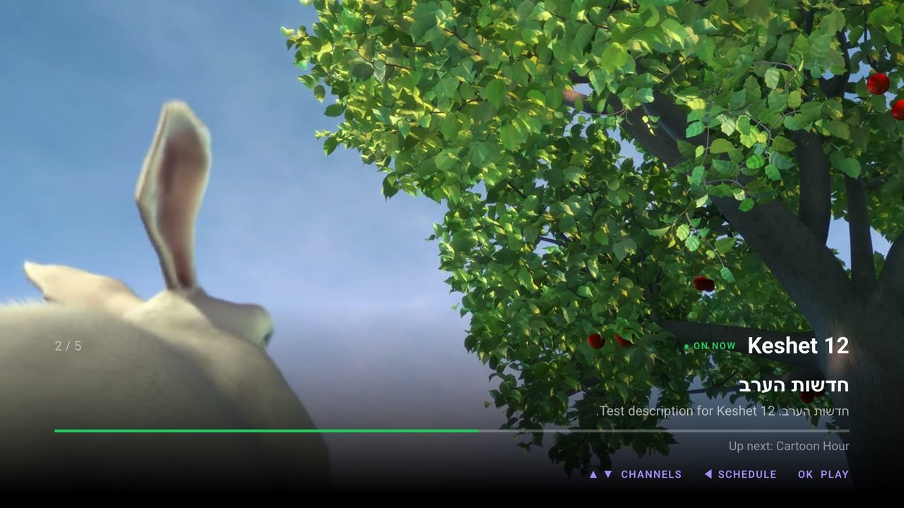<br>**LG TV player** |

<sub>Screenshots use a test playlist: the Android TV emulator, and the LG app's desktop build.</sub>

---

## 🎮 Remote at a glance

| On the home screen | While watching |
|---|---|
| **Arrows:** move between channels. LEFT from the first card opens the menu. | **UP / DOWN:** browse channels |
| **OK:** watch | **LEFT / RIGHT:** browse the schedule (live) or seek (movies) |
| **Hold OK:** channel menu | **OK:** play the browsed channel, or pause a movie |
| **Back:** go to the menu | **Back:** close the overlay, then return home |

On an LG TV the **Magic Remote** works too: point at a channel to focus it and click to press.

---

## ❓ Questions

- **Updating to a new version:** install the new file the same way. It installs over the old one and keeps your settings.
- **"App not installed" (Android TV):** uninstall any older StreamFlow build first, then install again.
- **The QR page won't open on my phone (Android TV):** make sure the phone and the TV are on the same Wi-Fi network.
- **StreamFlow disappeared from my LG TV:** the Developer Mode session ran out. Turn Developer Mode on again, install the IPK again, and extend the session every few weeks from then on.
- **Typing a long link on the LG TV is slow:** use the LG ThinQ app on your phone as the TV's keyboard.

<p align="center">
  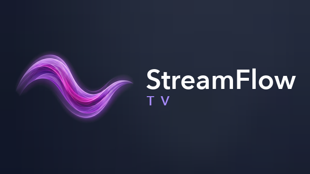
</p>
